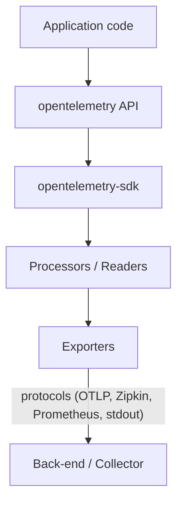

# OpenTelemetry Rust – Architecture Overview

> Status:Development 
> Last Updated: 2025-07-16

## 1 Purpose
This document provides a high-level description of how the OpenTelemetry Rust implementation is put together.  Detailed per-signal design notes live in their own files; this overview ties the pieces together.

> Reference: the [OpenTelemetry Specification](https://opentelemetry.io/docs/specs/otel/) and its [GitHub repository](https://github.com/open-telemetry/opentelemetry-specification/)

## 2 Layering

Key points:
1. The **API** crate is a lightweight facade that library and application code instrument against.
2. The **SDK** crate supplies concrete implementations, batching, aggregation, and lifecycle management.  
   • **Processors / readers** live inside the SDK and adapt buffering and temporality.
3. **Exporters** translate OTel data into wire formats (OTLP, Prometheus, etc.) and handle transport.

## 3 Cross-cutting Components
* **Resource** – a representation of the entity producing telemetry - see the [resource spec](https://opentelemetry.io/docs/specs/otel/resource/).
* **Attributes** - a key-value pair used to annotate telemetry data - see the [common spec](https://opentelemetry.io/docs/specs/otel/common/#attributes).
* **Context & Propagation** – context management and carrier injection; see the [context propagation spec](https://opentelemetry.io/docs/specs/otel/context/).
* **Runtime model** — public APIs are agnostic to execution model (synchronous or asynchronous); implementations may support optional async exporters (e.g., Tokio) or blocking I/O, depending on configuration. 
* **Error taxonomy** – see [ADR 001 Error Handling](../adr/001_error_handling.md).

## Detailed Design

### Signals

* **Traces** – [design doc](./traces.md) 
* **Metrics** – [design doc](./metrics.md) 
* **Logs** – [design doc](./logs.md) 

### Exporters

* **OTLP** – [design doc](./otlp.md) — the OTLP exporter.

## 5 Extensibility Hooks
| Layer | Customisation points |
|-------|---------------------|
| SDK | Provide complete alternative SDK |
| SDK | Plug-in **samplers**, **metric readers**, and **log processors** |
| Exporters | Support additional wire-protocols |
