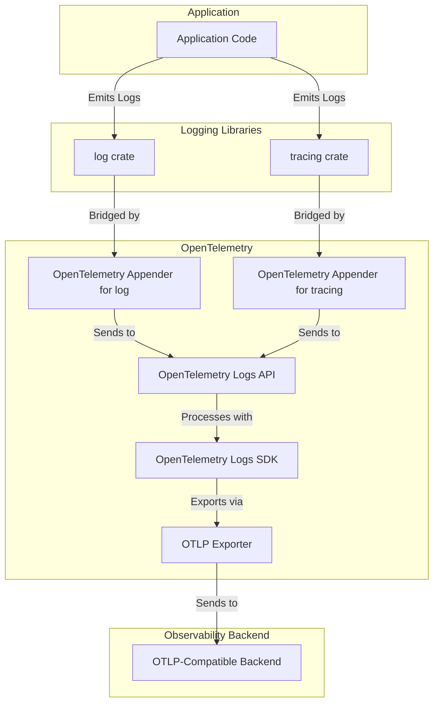

# OpenTelemetry Rust Logs Design

Status:
[Development](https://github.com/open-telemetry/opentelemetry-specification/blob/main/specification/document-status.md)

## Overview

[OpenTelemetry (OTel)
Logs](https://github.com/open-telemetry/opentelemetry-specification/blob/main/specification/logs/README.md)
support differs from Metrics and Traces as it does not introduce a new logging
API for end users. Instead, OTel recommends leveraging existing logging
libraries such as [log](https://crates.io/crates/log) and
[tracing](https://crates.io/crates/tracing), while providing bridges (appenders)
to route logs through OpenTelemetry.

OTel took this different approach due to the long history of existing logging
solutions. In Rust, these are [log](https://crates.io/crates/log) and
[tracing](https://crates.io/crates/tracing), and have been embraced in the
community for some time. OTel Rust maintains appenders for these libraries,
allowing users to seamlessly integrate with OpenTelemetry without changing their
existing logging instrumentation.

The `tracing` appender is particularly optimized for performance due to its
widespread adoption and the fact that `tracing` itself has a bridge from the
`log` crate. Notably, OpenTelemetry Rust itself is instrumented using `tracing`
for internal logs. Additionally, when OTel began supporting logging as a signal,
the `log` crate lacked structured logging support, reinforcing the decision to
prioritize `tracing`.

## Benefits of OpenTelemetry Logs

- **Unified configuration** across Traces, Metrics, and Logs.
- **Automatic correlation** with Traces.
- **Consistent Resource attributes** across signals.
- **Multiple destinations support**: Logs can continue flowing to existing
  destinations like stdout etc. while also being sent to an
  OpenTelemetry-capable backend, typically via an OTLP Exporter or exporters
  that export to operating system native systems like `Windows ETW` or `Linux
  user_events`.
- **Standalone logging support** for applications that use OpenTelemetry as
  their primary logging mechanism.

## Key Design Principles

- High performance - no locks/contention in the hot path with minimal/no heap
  allocation where possible.
- Capped resource (memory) usage - well-defined behavior when overloaded.
- Self-observable - exposes telemetry about itself to aid in troubleshooting
  etc.
- Robust error handling, returning Result where possible instead of panicking.
- Minimal public API, exposing based on need only.

## Architecture Overview

## Logs API

Logs API is part of the [opentelemetry](https://crates.io/crates/opentelemetry)
crate.

The OTel Logs API is not intended for direct end-user usage. Instead, it is
designed for appender/bridge authors to integrate existing logging libraries
with OpenTelemetry. However, there is nothing preventing it from being used by
end-users.

### API Components

1. **Key-Value Structs**: Used in `LogRecord`, where `Key` struct is shared
   across signals but `Value` struct differ from Metrics and Traces. This is
   because values in Logs can contain more complex structures than those in
   Traces and Metrics.
2. **Traits**:
    - `LoggerProvider` - provides methods to obtain Logger.
    - `Logger` - provides methods to create LogRecord and emit the created
      LogRecord.
    - `LogRecord` - provides methods to populate LogRecord.
3. **No-Op Implementations**: By default, the API performs no operations until
   an SDK is attached.

### Logs Flow

1. Obtain a `LoggerProvider` implementation.
2. Use the `LoggerProvider` to create `Logger` instances, specifying a scope
   name (module/component emitting logs). Optional attributes and version are
   also supported.
3. Use the `Logger` to create an empty `LogRecord` instance.
4. Populate the `LogRecord` with body, timestamp, attributes, etc.
5. Call `Logger.emit(LogRecord)` to process and export the log.

If only the Logs API is used (without an SDK), all the above steps result in no
operations, following OpenTelemetry’s philosophy of separating API from SDK. The
official Logs SDK provides real implementations to process and export logs.
Users or vendors can also provide alternative SDK implementations.

## Logs SDK

Logs SDK is part of the
[opentelemetry_sdk](https://crates.io/crates/opentelemetry_sdk) crate.

The OpenTelemetry Logs SDK provides an OTel specification-compliant
implementation of the Logs API, handling log processing and export.

### Core Components

#### `SdkLoggerProvider`

This is the implementation of the `LoggerProvider` and deals with concerns such
as processing and exporting Logs.

- Implements the `LoggerProvider` trait.
- Creates and manages `SdkLogger` instances.
- Holds logging configuration, including `Resource` and processors.
- Does not retain a list of created loggers. Instead, it passes an owned clone
  of itself to each logger created. This is done so that loggers get a hold of
  the configuration (like which processor to invoke).
- Uses an `Arc<LoggerProviderInner>` and delegates all configuration to
  `LoggerProviderInner`. This allows cheap cloning of itself and ensures all
  clones point to the same underlying configuration.
- As `SdkLoggerProvider` only holds an `Arc` of its inner, it can only take
  `&self` in its methods like flush and shutdown. Else it needs to rely on
  interior mutability that comes with runtime performance costs. Since methods
  like shutdown usually need to mutate interior state, but this component can
  only take `&self`, it defers to components like exporter to use interior
  mutability to handle shutdown. (More on this in the exporter section)
- An alternative design was to let `SdkLogger` hold a `Weak` reference to the
  `SdkLoggerProvider`. This would be a `weak->arc` upgrade in every log
  emission, significantly affecting throughput.
- `LoggerProviderInner` implements `Drop`, triggering `shutdown()` when no
  references remain. However, in practice, loggers are often stored statically
  inside appenders (like tracing-appender), so explicit shutdown by the user is
  required.

#### `SdkLogger`

This is an implementation of the `Logger`, and contains functionality to create
and emit logs.

- Implements the `Logger` trait.
- Creates `SdkLogRecord` instances and emits them.
- Calls `OnEmit()` on all registered processors when emitting logs.
- Passes mutable references to each processor (`&mut log_record`), i.e.,
  ownership is not passed to the processor. This ensures that the logger avoids
  cloning costs. Since a mutable reference is passed, processors can modify the
  log, and it will be visible to the next processor in the chain.
- Since the processor only gets a reference to the log, it cannot store it
  beyond the `OnEmit()`. If a processor needs to buffer logs, it must explicitly
  copy them to the heap.
- This design allows for stack-only log processing when exporting to operating
  system native facilities like `Windows ETW` or `Linux user_events`.
- OTLP Exporting requires network calls (HTTP/gRPC) and batching of logs for
  efficiency purposes. These exporters buffer log records by copying them to the
  heap. (More on this in the BatchLogRecordProcessor section)

#### `LogRecord`

- Holds log data, including attributes.
- Uses an inline array for up to 5 attributes to optimize stack usage.
- Falls back to a heap-allocated `Vec` if more attributes are required.
- Inspired by Go’s `slog` library for efficiency.

#### LogRecord Processors

`SdkLoggerProvider` allows being configured with any number of LogProcessors.
They get called in the order of registration. Log records are passed to the
`OnEmit` method of LogProcessor. LogProcessors can be used to process the log
records, enrich them, filter them, and export to destinations by leveraging
LogRecord Exporters.

Similar to [LoggerProvider](#sdkloggerprovider), methods on the `LogProcessor`
trait also takes a immutable self (`&self`) only, forcing the need to use
interior mutability, if any mutation is required. The exception to this is
`set_resource`, which takes a `&mut self`. This is acceptable as `set_resource`
is called by the `SdkLoggerProvider` during build() method only, and is not
required after that.

Following built-in Log processors are provided in the Log SDK:

##### SimpleLogProcessor

This processor is designed to be used for exporting purposes. Export is handled
by an Exporter (which is a separate component). SimpleLogProcessor is "simple"
in the sense that it does not attempt to do any processing - it just calls the
exporter and passes the log record to it. To comply with OTel specification, it
synchronizes calls to the `Export()` method, i.e., only one `Export()` call will
be done at any given time.

SimpleLogProcessor is only used for test/learning purposes and is often used
along with a `stdout` exporter.

##### BatchLogProcessor

This is another "exporting" processor. As with SimpleLogProcessor, a different
component named LogExporter handles the actual export logic. BatchLogProcessor
buffers/batches the logs it receives into an in-memory buffer. It invokes the
exporter every 1 second or when 512 items are in the batch (customizable). It
uses a background thread to do the export, and communication between the user
thread (where logs are emitted) and the background thread occurs with `mpsc`
channels.

The max amount of items the buffer holds is 2048 (customizable). Once the limit
is reached, any *new* logs are dropped. It *does not* apply back-pressure to the
user thread and instead drops logs.

As with SimpleLogProcessor, this component also ensures only one export is
active at a given time. A modified version of this is required to achieve higher
throughput in some environments.

In this design, at most 2048+512 logs can be in memory at any given point. In
other words, that many logs can be lost if the app crashes in the middle.

## LogExporters

LogExporters are responsible for exporting logs to a destination.
`SdkLoggerProvider` does not have a direct knowledge of the `LogExporter`, as it
only deals with `LogProcessors`. It is the `LogProcessor`s that invokes
`LogExporter` methods. Most methods on `LogExporter` trait also only takes
`&self`, following the same reasoning as [LogProcessors](#logrecord-processors)

Some of the exporters are:

1. **InMemoryExporter** - exports to an in-memory list, primarily for
   unit-testing. This is used extensively in the repo itself, and external users
   are also encouraged to use this.
2. **Stdout exporter** - prints telemetry to stdout. Only for debugging/learning
   purposes. The output format is not defined and also is not performance
   optimized. A production-recommended version with a standardized output format
   is in the plan.
3. **OTLP Exporter** - OTel's official exporter which uses the OTLP protocol
   that is designed with the OTel data model in mind. Both HTTP and gRPC-based
   exporting is offered.
4. **Exporters to OS Kernel facilities** - These exporters are not maintained in
   the core repo but listed for completion. They export telemetry to Windows ETW
   or Linux user_events. They are designed for high-performance workloads. Due
   to their nature of synchronous exporting, they do not require
   buffering/batching. This allows logs to operate entirely on the stack and can
   scale easily with the number of CPU cores. (Kernel uses per-CPU buffers for
   the events, ensuring no contention)

## `tracing` Log Appender

Tracing appender is part of the
[opentelemetry-appender-tracing](https://crates.io/crates/opentelemetry-appender-tracing)
crate.

The `tracing` appender bridges `tracing` logs to OpenTelemetry. Logs emitted via
`tracing` macros (`info!`, `warn!`, etc.) are forwarded to OpenTelemetry through
this integration.

- `tracing` is designed for high performance, using *layers* or *subscribers* to
  handle emitted logs (events).
- The appender implements a `Layer`, receiving logs from `tracing`.
- Uses the OTel Logs API to create `LogRecord`, populate it, and emit it via
  `Logger.emit(LogRecord)`.
- If no Logs SDK is present, the process is a no-op.

Note on terminology: Within OpenTelemetry, "tracing" refers to distributed
tracing (i.e creation of Spans) and not in-process structured logging and
execution traces. The crate "tracing" has notion of creating Spans as well as
Events. The events from "tracing" crate is what gets converted to OTel Logs,
when using this appender. Spans created using "tracing" crate is not handled by
this crate.

## Performance

// Call out things done specifically for performance
// Rough draft

1. `LogRecord` is stack allocated and not Boxed unless required by the component
needing to store it beyond the logging call. (eg: BatchProcessor)
2. LogRecords's Attribute storage is specially designed struct, that holds up to
five attributes in stack.
3. When passing `LogRecord`s to processor, a mutable ref is passed. This allows
calling multiple processors one after another, without the need for cloning.
4. `Logger` provides a `Enabled` check which can optimize performance when
no-one is interested in the log. The check is passed from `Logger` to the
processor, which may consult its exporter to make the decision. An example use
case - an ETW or user-events exporter can check for the presence of listener and
convey that decision back to logger, allowing appender to avoid even the cost of
creating a `LogRecord` in the first place if there is no listener. This check is
done for each log emission, and can react dynamically to changes in interest, by
enabling/disabling ETW/user-event listener.
5. `tracing` has a notion of "target", which is expected to be mapped to OTel's
concept of Instrumentation Scope for Logs, when `OpenTelemetry-Tracing-Appender`
bridges `tracing` to OpenTelemetry. Since scopes are tied to Loggers, a naive
approach would require creating a separate logger for each unique target. This
would necessitate an RWLock-protected HashMap lookup, introducing contention and
reducing throughput. To avoid this, `OpenTelemetry-Tracing-Appender` instead
stores the target directly in the LogRecord as a top-level field, ensuring fast
access in the hot path. Components processing the LogRecord can retrieve the
target via LogRecord.target(), treating it as the scope. The OTLP Exporter
already handles this automatically, so end-users will see “target” reflected in
the Instrumentation Scope. An alternative design would be to use thread-local
HashMaps - but it can cause increased memory usage, as there can be 100s of
unique targets. (because `tracing` defaults to using module path as target).

### Perf test - benchmarks

// Share ~~ numbers

### Perf test - stress test

// Share ~~ numbers

## Internal logs

OTel itself is instrumented with `tracing` crate to emit internal logs about its
operations. This is feature gated under "internal-logs", and is enabled by
default for all components. The `opentelemetry` provide few helper macros
`otel_warn` etc., which in turn invokes various `tracing` macros like `warn!`
etc. The cargo package name will be set as `target` when using `tracing`. For
example, logs from `opentelemetry-otlp` will have target set to
"opentelemetry-otlp".

The helper macros are part of public API, so can be used by anyone. But it is
only meant for OTel components itself and anyone writing extensions like custom
Exporters etc.

// TODO: Document the principles followed when selecting severity for internal
logs

When OpenTelemetry components generate logs that could potentially feed back
into OpenTelemetry, this can result in what is known as "telemetry-induced
telemetry." To address this, OpenTelemetry provides a mechanism to suppress such
telemetry using the `Context`. Components are expected to mark telemetry as
suppressed within a specific `Context` by invoking
`Context::enter_telemetry_suppressed_scope()`. The Logs SDK implementation
checks this flag in the current `Context` and ignores logs if suppression is
enabled.

This mechanism relies on proper in-process propagation of the `Context`.
However, external libraries like `hyper` and `tonic`, which are used by
OpenTelemetry in its OTLP Exporters, do not propagate OpenTelemetry's `Context`.
As a result, the suppression mechanism does not work out-of-the-box to suppress
logs originating from these libraries.

// TODO: Document how OTLP can solve this issue without asking external
crates to respect and propagate OTel Context.

## Summary

- OpenTelemetry Logs does not provide a user-facing logging API.
- Instead, it integrates with existing logging libraries (`log`, `tracing`).
- The Logs API defines key traits but performs no operations unless an SDK is
  installed.
- The Logs SDK enables log processing, transformation, and export.
- The Logs SDK is performance optimized to minimize copying and heap allocation,
  wherever feasible.
- The `tracing` appender efficiently routes logs to OpenTelemetry without
  modifying existing logging workflows.
