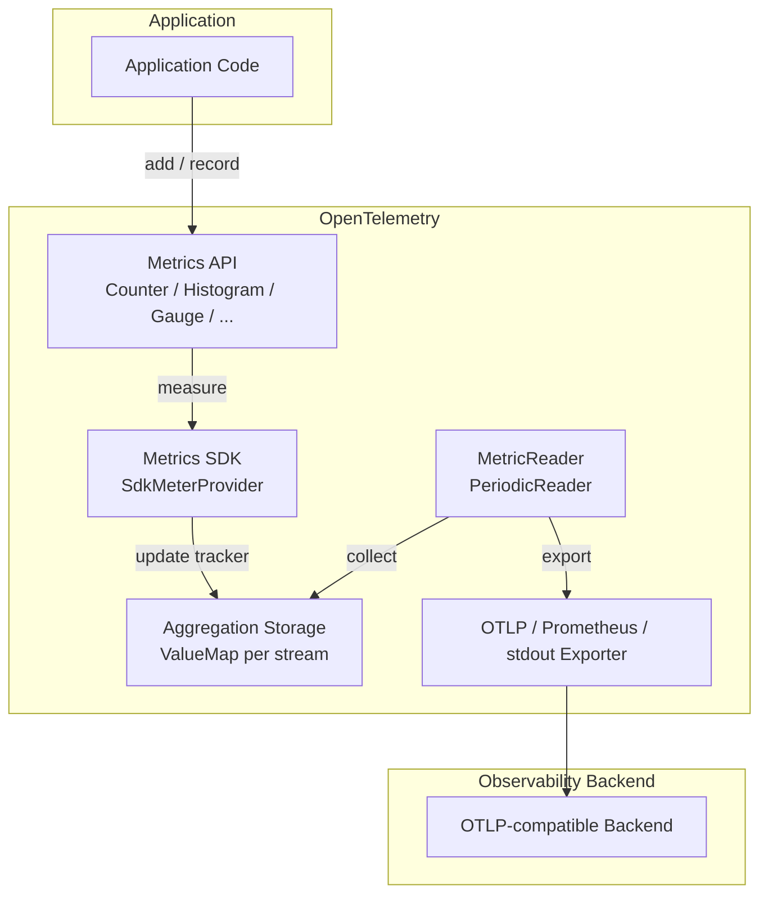

# OpenTelemetry Rust Metrics Design

Status:
[Development](https://github.com/open-telemetry/opentelemetry-specification/blob/main/specification/document-status.md)

## Overview

[OpenTelemetry (OTel)
Metrics](https://github.com/open-telemetry/opentelemetry-specification/blob/main/specification/metrics/README.md)
in Rust exposes an instrument-based API (`Counter`, `UpDownCounter`,
`Histogram`, `Gauge`, plus their `Observable` async counterparts) and a Rust
SDK that pre-aggregates measurements in process. The aggregated state is then
made available to a backend either by a push-based exporter on a periodic
schedule (OTLP, stdout) or pulled on demand by a scrape endpoint (Prometheus).

Unlike Logs (which bridges existing logging crates) and Traces (which exposes
spans), Metrics is the signal where the per-measurement hot path matters most:
a single counter may be incremented millions of times per second from many
threads. Most of the design described below exists to keep that call cheap and
predictable.

This document covers the architectural choices. User-facing guidance on how to
choose instruments, attributes, and cardinality limits lives in
[docs/metrics.md](../metrics.md).

## Key Design Principles

- High performance — a single `Counter::add(...)` is a hash lookup plus a
  lock-free atomic increment.
- Capped resource (memory) usage — every aggregation stream has a cardinality
  limit; overflow is folded into a single overflow series.
- Pre-aggregation in-process — the SDK never buffers raw measurements; it
  collapses them into per-attribute-set state, which a reader then exports
  on a periodic schedule (OTLP, stdout) or surfaces on demand to a scrape
  endpoint (Prometheus).
- Self-observable — the SDK can emit metrics about itself, gated on a feature
  flag (see [observability.md](observability.md)).

## Architecture Overview



## Metrics API

The API lives in the [opentelemetry](https://crates.io/crates/opentelemetry)
crate.

- `MeterProvider` — entry point; returns `Meter` instances per
  `InstrumentationScope`.
- `Meter` — factory for instruments. Cheap to clone; expected to be created
  once and reused.
- Synchronous instruments: `Counter<T>`, `UpDownCounter<T>`, `Histogram<T>`,
  `Gauge<T>`. Measurements are reported by the calling thread on the call
  site (`counter.add(v, &[KeyValue::new("k", "v")])`).
- Asynchronous instruments: `ObservableCounter<T>`, `ObservableUpDownCounter<T>`,
  `ObservableGauge<T>`. The caller registers a callback once; the SDK
  invokes it during collection.
- No-op semantics: until an SDK is installed, every instrument returned by the
  global `Meter` is backed by `NoopSyncInstrument` and silently drops
  measurements.

`Counter` (and friends) is intentionally `Clone` and cheap to pass around —
the heavy state lives behind an `Arc` inside the SDK.

## Metrics SDK

The SDK lives in [opentelemetry_sdk::metrics](../../opentelemetry-sdk/src/metrics/).

### `SdkMeterProvider`

- Holds an `Arc<SdkMeterProviderInner>`; clones are cheap and share state.
- Owns the configured `Resource`, the list of `MetricReader`s, and the
  registered `View`s — collectively the `Pipelines`.
- Caches created meters by `InstrumentationScope`, so repeated
  `meter_with_scope(...)` calls return the same `SdkMeter` rather than
  building a new aggregation pipeline.
- `shutdown()` and `force_flush()` take `&self` and delegate to each reader;
  shutdown is idempotent and guarded by an `AtomicBool`. `Drop` invokes
  shutdown if the user did not.

### `SdkMeter` and instrument construction

- When an instrument is built (e.g. `meter.u64_counter("foo").build()`), the
  meter walks the registered `View`s to decide the final stream name,
  description, unit, aggregation, attribute filter, and cardinality limit.
- For each matching reader, an aggregation stream is created with its own
  `ValueMap` (the per-stream state container described below).
- The resulting instrument holds an `Arc` to the per-reader aggregator(s), so
  cloning a `Counter` is just an Arc bump.

### Aggregation storage — `ValueMap`

A `ValueMap<A>` is the per-stream hot-path data structure. It is shared by
every thread that updates that stream and by the collector thread that reads
it on each export cycle.

Conceptually it is:

```text
RwLock< HashMap< Vec<KeyValue>, Arc<TrackerEntry<A>> > >
```

Each `TrackerEntry` holds the aggregator state (`A`, e.g. an
`AtomicU64`-backed sum) and a `has_been_updated` flag used by delta
collection. The key tricks on the write path are:

1. **Empty-attribute fast path.** A dedicated `no_attribute_tracker` is held
   directly on the `ValueMap`. `counter.add(1, &[])` skips the lock and map
   entirely and goes straight to the atomic update.

2. **Try the caller's order first, under a read lock.** The map is looked up
   using the attribute slice exactly as the caller passed it — no copy, no
   sort. If the same call site always passes attributes in the same order
   (which it typically does), every measurement past the first hits this
   branch: one hash lookup, one atomic update, read lock released.

3. **Fall back to a sorted/deduplicated key, still under the read lock.** If
   the unsorted lookup misses, the SDK builds a canonical sorted+deduped
   `Vec<KeyValue>` and tries again. This is the only path that allocates on
   the hot path, and it is taken only when the caller varies attribute order
   or has duplicate keys.

4. **Upgrade to a write lock only when the attribute set is genuinely new.**
   After dropping the read lock, the SDK takes the write lock, re-checks
   both keys (to handle the race where another thread inserted in the
   meantime), and only then allocates a new `TrackerEntry`.

5. **Insert under both keys.** A new tracker is inserted under *both* the
   caller's order *and* the canonical sorted order. This means subsequent
   calls from any other thread, in either order, hit the read-lock fast path
   without needing a second sort.

6. **Lock-free aggregator updates (for sums and gauges).** For
   `Counter`/`UpDownCounter`/`Gauge`, the aggregator state is a single
   atomic — typically `AtomicU64`/`AtomicI64`, with `f64` bit-cast through
   `AtomicU64`. Updates use `Relaxed` for the value and a `Release` store on
   `has_been_updated`. `Histogram` and `ExponentialHistogram` need to update
   bucket counts plus sum/min/max together, so they wrap the per-tracker
   bucket array in a short `Mutex`. The `ValueMap` read lock is held only
   across the lookup, never across the update.

The net effect: for sum and gauge instruments the common case — known
attribute set, known order — is a read-locked hash lookup followed by a
single atomic increment. No copying, no sorting, no allocation. Histograms
add a short per-tracker `Mutex` on top of the same lookup.

### Cardinality limits and overflow

Every stream has a cardinality cap (default 2000, configurable per-instrument
via `View` / `Stream`). Once the map is at the limit, the next never-seen
attribute set does **not** allocate a new tracker; instead its measurement is
folded into a single overflow tracker keyed by `otel.metric.overflow = true`.
This bounds memory under cardinality explosions and, importantly, keeps the
hot path's worst case at "two hash misses then write to the overflow
tracker" — it never degenerates into unbounded growth.

### Contention

Even though the hot path holds only a read lock and the leaf update is an
atomic, every writer thread for a given stream contends on the same
`RwLock` and the same `HashMap` cache lines. At low-to-moderate core counts
this is invisible; at high core counts (tens of CPUs hammering the same
counter) throughput stops scaling and can regress as the read-lock acquire
becomes the bottleneck. Histograms feel this earlier because the per-tracker
`Mutex` adds a second contention point. The stress harnesses under
[stress/src/](../../stress/src/) (`metrics_counter`, `metrics_histogram`)
exist specifically to expose this.

Several attempts have been made to relieve it — partitioned hashing
([#1564](https://github.com/open-telemetry/opentelemetry-rust/pull/1564)),
a hand-written sharded `ValueMap`
([#2304](https://github.com/open-telemetry/opentelemetry-rust/pull/2304)),
and per-thread shards
([#3473](https://github.com/open-telemetry/opentelemetry-rust/pull/3473))
— none of which have merged. The recurring blockers are the cost of merging
shard state on collection, how shard-local cardinality interacts with the
per-stream cardinality limit, and how a sharded design composes with the
bound-instrument fast path (which assumes a single `Arc<TrackerEntry>` per
attribute set). [#2450](https://github.com/open-telemetry/opentelemetry-rust/issues/2450)
is the umbrella tracking issue.

A separate, more invasive direction is sketched in
[#1386](https://github.com/open-telemetry/opentelemetry-rust/issues/1386):
aggregate measurements into a `!Send` thread-local buffer on the hot path
(so updates need no synchronization at all) and have the collector merge
those buffers into the shared `ValueMap` in the background. That removes
the read-lock entirely on the write path but requires a deeper API change
than the sharding PRs above and has not been prototyped end-to-end.

For now, the recommended workaround for known hot counters is bound
instruments, which sidestep the lookup entirely. Applications that genuinely
need many cores updating the same unbound instrument can also fall back to a
per-thread `MeterProvider` pattern, at the cost of duplicating exporter
state.

### Asynchronous instruments

For `ObservableCounter` and friends, the user-supplied callback is invoked by
the `MetricReader` at collection time, inside a context-suppressed scope so
the callback's own instrumentation does not feed back into the pipeline. The
callback writes measurements into the same `ValueMap` machinery as the sync
path — there is no separate storage.

## Bound Instruments (experimental)

Gated under the `experimental_metrics_bound_instruments` feature on both
`opentelemetry` and `opentelemetry-sdk`. Types: `BoundCounter<T>`,
`BoundUpDownCounter<T>`, `BoundHistogram<T>`, `BoundGauge<T>`, obtained via
`counter.bind(&attrs)`.

The motivation is the per-call cost of the unbound hot path. Even at its
fastest — one hash lookup plus one atomic increment — it is ~50 ns per call
on commodity hardware (measured on Apple M4 Pro). Most of that is the
attribute lookup; the atomic is essentially free.

`bind(&attrs)` walks the unbound path **once** to resolve the
`Arc<TrackerEntry>`, and returns a handle that holds it directly. From then
on, `bound.add(1)` is just the atomic increment — about **1.8 ns** on the
same hardware, ~27× faster than the unbound call. If the bind happens after
the cardinality limit is reached, the handle points at the overflow tracker,
so the perf contract holds regardless of cardinality state.

This makes bound instruments the practical substrate for hot-path
self-diagnostics — counters that are touched per log record or per export —
which is why
[observability.md](observability.md) requires this feature to enable SDK
self-metrics.

The feature is experimental because the API shape (ergonomics of `bind` /
how bound handles interact with `View`s and cardinality) is still settling
in the [specification](https://github.com/open-telemetry/opentelemetry-specification);
the underlying mechanism is stable.

## Views

A `View` is a function `&Instrument -> Option<Stream>` registered on the
`MeterProvider` builder. Views can rename or re-describe an instrument,
override its aggregation (e.g. force a `Histogram` to use explicit boundaries
or change a `Counter` to drop), filter its attributes down to a smaller set
(reducing cardinality), or tighten its cardinality limit. View matching
happens once at instrument creation, not on the hot path.

## MetricReaders and Exporters

`MetricReader` is the collection side of the pipeline: it pulls aggregated
state from the SDK and either pushes it to an exporter on a schedule or
serves it on demand to an external scraper.

- `PeriodicReader` runs on a dedicated background thread, collects on a
  configurable interval (default 60s, also overridable via
  `OTEL_METRIC_EXPORT_INTERVAL_MILLIS`), and calls the exporter
  synchronously. Time spent exporting is not counted against the interval.
  Used with OTLP, stdout, and in-memory exporters.
- The Prometheus exporter is a `MetricReader` that does not push at all;
  it triggers collection inline when its HTTP handler is called, so the
  scrape itself drives the read of the `ValueMap`s. There is no background
  thread and no configurable interval — cadence is set by the scraper.
- The collector pulls from each `ValueMap` under a short read/write lock and
  emits either `Cumulative` or `Delta` data depending on the configured
  temporality. For `Delta`, only trackers whose `has_been_updated` flag is
  set since the last collection contribute, and the flag is cleared.

Built-in exporters:

1. **InMemoryExporter** — stores `ResourceMetrics` in a `VecDeque`, used
   extensively for tests.
2. **Stdout exporter** — debug/learning only; format is not stable.
3. **OTLP exporter** — production exporter, gRPC or HTTP, in
   `opentelemetry-otlp`.
4. **Prometheus exporter** — pull-based, exposes a `/metrics` endpoint, in
   the `opentelemetry-prometheus` crate.

## Self-observability

The metrics SDK is the substrate the rest of the SDK uses to report on its
own internals (e.g. `BatchLogProcessor` queue-full drops). The full design,
including the initialization-order constraint and the feature flag, is in
[observability.md](observability.md). The relevant point for this document
is that practical self-diagnostics is what motivates bound instruments — a
counter incremented on every `emit()` would be too expensive otherwise.

## Summary

- The Metrics API exposes synchronous and asynchronous instruments; the API
  alone is a no-op until an SDK is installed.
- The SDK pre-aggregates measurements per stream in a `ValueMap`. The hot
  path is a read-locked hash lookup using the caller's attribute order,
  falling back to a sorted key only on miss, with a write lock only when the
  attribute set is genuinely new.
- For sum and gauge instruments the per-attribute-set update is a lock-free
  atomic; histograms add a short per-tracker `Mutex`. Copying and sorting
  are avoided whenever the caller is consistent.
- Cardinality is bounded per stream by folding overflow into a single
  series, keeping memory and worst-case latency predictable.
- Bound instruments resolve the attribute lookup once and turn subsequent
  updates into a single atomic — the basis for hot-path self-diagnostics.
- `MetricReader`s collect on a schedule and hand off to OTLP, Prometheus,
  stdout, or in-memory exporters.
