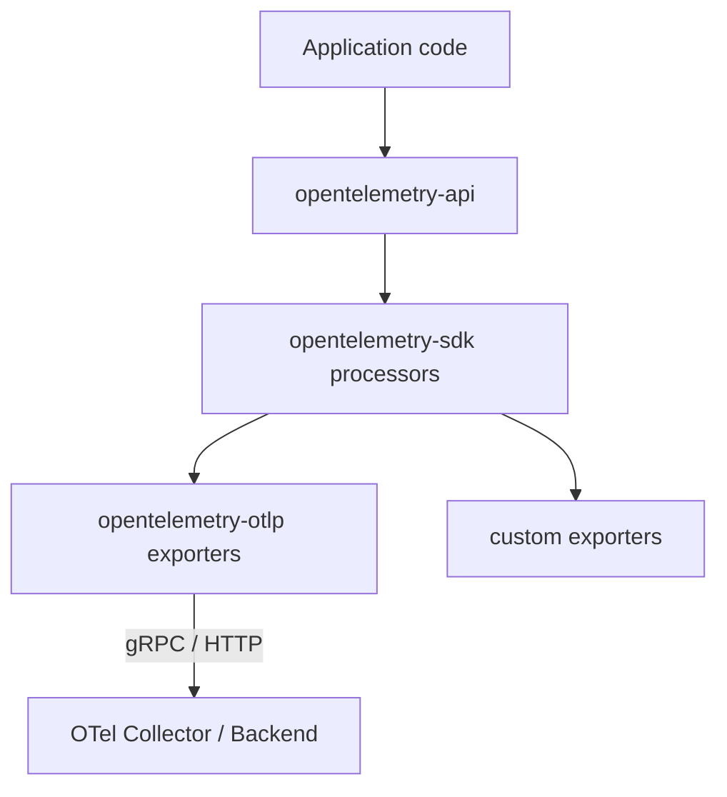
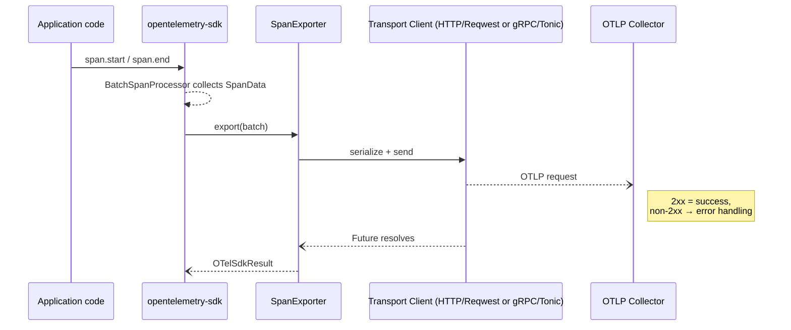

# OpenTelemetry Rust – OTLP Architecture

> Status:Development 
> Last Updated: 2025-07-16

This document describes how the **OTLP exporters** are organised and how they integrate with the wider OpenTelemetry Rust SDK.  

> Reference the [OTLP specification](https://opentelemetry.io/docs/specs/otlp/) and [OTLP Protocol Exporter specification](https://opentelemetry.io/docs/specs/otel/protocol/exporter/). 

## Overview
OpenTelemetry Protocol (OTLP) is the vendor-agnostic wire format used by OpenTelemetry to transport telemetry signals (traces, metrics, logs) from instrumented code to a backend (OTel Collector or compatible vendor). It supports:

* **Encodings**  
  * *Protobuf* – canonical format  
  * *JSON* (optional)
* **Transports**  
  * *gRPC* (default port `4317`)  
  * *HTTP/1.1*, *HTTP/2* (default port `4318`, binary protobuf or JSON payloads)
* **Signals**  
  * Traces, Metrics, Logs – transported independently but share common envelope types (`Resource`, `Scope` etc.)

## 2. Overall Structure of `opentelemetry-rust` and OTLP


Important details:

* `opentelemetry-sdk` owns batching, aggregation, lifecycle; **exporters handle serialization, transport, and may implement retry policy**.
* Each signal (trace/metric/log) has its own exporter type but they share common builder + transport modules.

---

## 3. Crate Layout
```text
src/
  lib.rs                 # Re-exports + feature flags + protocol enum
  span.rs | metric.rs | logs.rs   # Signal-specific builders/exporters
  exporter/
     ├── mod.rs          # Common builder traits, env var parsing, compression
     ├── http/           # Reqwest blocking/async clients, body encoder
     └── tonic/          # Tonic client, TLS/compression helpers
```
### 3.1 Common Interfaces
* **`HasExportConfig` / `WithExportConfig`** – traits mixed into builders to expose shared config (`endpoint`, `timeout`, `protocol`).
* **Builder marker types** (`NoExporterBuilderSet`, `HttpExporterBuilderSet`, `TonicExporterBuilderSet`) enforce at compile time that exactly *one* transport is chosen.
* **`SupportedTransportClient` enum** – run-time dispatch inside the exporter when sending.

---

## 4. Feature-Flag Matrix
| Cargo feature | Purpose | Conditional modules |
|---------------|---------|---------------------|
| `trace` / `metrics` / `logs` | Enable signal exporters | `span.rs`, `metric.rs`, `logs.rs` |
| `grpc-tonic` | Use `tonic` gRPC transport | `exporter/tonic` |
| `http-proto` *(default)* | HTTP + protobuf body | `exporter/http` |
| `http-json` | HTTP + JSON body | `exporter/http` |
| `gzip-tonic` `zstd-tonic` | gRPC message compression | `exporter/tonic` |
| `reqwest-client` / `reqwest-blocking-client` *(default)* | Choose async vs blocking Reqwest HTTP client |
| `hyper-client` | Use Hyper HTTP transport *(requires both Reqwest features disabled)* |
| TLS helpers (`tls-roots`, `tls-webpki-roots`, `reqwest-rustls`) | Supply trust roots for TLS |

Because **only one transport is valid per exporter**, `protocol` is currently a *hint* – unsupported values are ignored by the concrete builder.

### 4.1 Transport-specific Client Options

Exporters must function both in binaries that start no async runtime and in services already running async runtimes such as Tokio.  Consequently the crate provides **blocking** and **non-blocking** HTTP clients behind mutually-exclusive feature-flags.  The blocking variant is the default to ensure out-of-the-box operability; applications that already depend on Tokio can opt into an async client to avoid spawning extra threads.

| Implementation | Feature flag | Blocking? | Underlying crate | Transports | Typical use case |
|---------------|--------------|-----------|------------------|-----------|------------------|
| Reqwest (synchronous) **(default)** | `reqwest-blocking-client` | Yes | `reqwest::blocking` | HTTP/1.1 → auto-upgrades to HTTP/2 over TLS | CLI tools, synchronous binaries, or hybrid apps where introducing Tokio is undesirable. A helper thread is spawned once at builder time.
| Reqwest (async) | `reqwest-client` | No (Tokio) | `reqwest` | HTTP/1.1 → auto-upgrades to HTTP/2 over TLS | Services that already run a Tokio runtime and prefer fully non-blocking exports.
| Hyper | `hyper-client` | No (Tokio) | `hyper` | HTTP/1.1 → auto-upgrades to HTTP/2 over TLS | Lean dependency footprint when both Reqwest features are disabled.
| Tonic (async gRPC) | `grpc-tonic` | No (Tokio) | `tonic` | HTTP/2 (gRPC) | A desire to use gRPC exporter. 
| Custom | — | Depends | user-supplied | depends on implementation | Embedding a bespoke `HttpClient` via `.with_http_client()`.

---

## 5. Runtime Flow (Trace Export)

Notes: 

* Serialization happens **inside the transport client** module to keep exporters thin.
* `export` methods return futures, surfaced via signal exporters implementing their respective exporter traits (`SpanExporter`, `PushMetricExporter`, `LogExporter`).
* Resource attributes are injected once per exporter via `set_resource()` before first export.

---

## 6. Configuration & Environment Variable Resolution
`exporter::mod.rs` implements helper fns:
* `default_protocol()` – chosen from compile-time defaults.
* `resolve_timeout()` – precedence: signal-specific env → generic env → builder → default 10 s.
* `parse_header_string()` – parses comma-separated `k=v` pairs with URL-decoding.
* `resolve_temporality()` – precedence: builder → `OTEL_EXPORTER_OTLP_METRICS_TEMPORALITY_PREFERENCE` env → default Cumulative.

Signal builders read **signal-specific env vars** (e.g. `OTEL_EXPORTER_OTLP_TRACES_ENDPOINT`) _before_ generic ones, matching the spec.

---

## 7. Error Handling Strategy
`ExporterBuildError` is a non-exhaustive enum covering:
* Builder-time validation (URI parse, missing client)
* Feature gating errors (compression requested w/o feature)
* Runtime errors are wrapped in `OTelSdkError` from the SDK.

Builder fails fast, runtime exporter surfaces errors through `export()` futures so processors (or Retry logic) can decide whether to back-off, drop, or escalate.

---

## 8. Extension & Customisation Points
1. **Custom headers / metadata** – `.with_metadata(map)` (gRPC) or `.with_headers()` (HTTP).
2. **Compression** – `.with_compression(Compression::Gzip | Compression::Zstd)` behind feature-flags.
3. **TLS** – via `TonicConfig` or `HttpConfig`; root-store helper features embed common CA bundles.
4. **Alternate HTTP client** – inject any `HttpClient` implementation via `.with_http_client()`.
5. **Protocol JSON** – switch to JSON payloads at build-time with the `http-json` feature.

---

## 9. Key Architectural Decisions
| Decision | Rationale |
|----------|-----------|
| *Builder pattern with marker types* | Compile-time guarantee that exactly one transport is chosen. |
| *Transport-specific modules* | Keep heavy deps (`tonic`, `reqwest`) behind feature-flags to minimise compile times. |

---

### Source References
* Builder traits – [`exporter/mod.rs`](../../opentelemetry-otlp/src/exporter/mod.rs)
* HTTP transport – [`exporter/http/mod.rs`](../../opentelemetry-otlp/src/exporter/http/mod.rs)
* gRPC transport – [`exporter/tonic/mod.rs`](../../opentelemetry-otlp/src/exporter/tonic/mod.rs)
* Span exporter – [`span.rs`](../../opentelemetry-otlp/src/span.rs)
* Metric exporter – [`metric.rs`](../../opentelemetry-otlp/src/metric.rs)
* Logs exporter – [`logs.rs`](../../opentelemetry-otlp/src/logs.rs)
