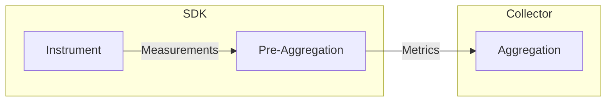

# OpenTelemetry Rust Metrics

Status: **Work-In-Progress**

<details>
<summary>Table of Contents</summary>

* [Introduction](#introduction)
* [Best Practices](#best-practices)
* [Metrics API](#metrics-api)
  * [Meter](#meter)
  * [Instruments](#instruments)
  * [Reporting measurements - use array slices for
    attributes](#reporting-measurements---use-array-slices-for-attributes)
  * [Reporting measurements via synchronous
    instruments](#reporting-measurements-via-synchronous-instruments)
  * [Reporting measurements via asynchronous
    instruments](#reporting-measurements-via-asynchronous-instruments)
* [MeterProvider Management](#meterprovider-management)
* [Memory Management](#memory-management)
  * [Example](#example)
  * [Pre-Aggregation](#pre-aggregation)
    * [Pre-Aggregation Benefits](#pre-aggregation-benefits)
  * [Cardinality Limits](#cardinality-limits)
    * [Cardinality Limits - Implications](#cardinality-limits---implications)
    * [Cardinality Limits - Example](#cardinality-limits---example)
  * [Memory Preallocation](#memory-preallocation)
* [Metrics Correlation](#metrics-correlation)
* [Modelling Metric Attributes](#modelling-metric-attributes)
* [Common Issues Leading to Missing
  Metrics](#common-issues-that-lead-to-missing-metrics)

</details>

## Introduction

This document provides comprehensive guidance on leveraging OpenTelemetry
metrics in Rust applications. Whether you're tracking request counts, monitoring
response times, or analyzing resource utilization, this guide equips you with
the knowledge to implement robust and efficient metrics collection.

It covers best practices, API usage patterns, memory management techniques, and
advanced topics to help you design effective metrics solutions while steering
clear of common challenges.

## Best Practices

// TODO: Add link to the examples, once they are modified to show best
practices.

## Metrics API

### Meter

[Meter](https://docs.rs/opentelemetry/latest/opentelemetry/metrics/struct.Meter.html)
provides the ability to create instruments for recording measurements or
accepting callbacks to report measurements.

:stop_sign: You should avoid creating duplicate
[`Meter`](https://docs.rs/opentelemetry/latest/opentelemetry/metrics/struct.Meter.html)
instances with the same name. `Meter` is fairly expensive and meant to be reused
throughout the application. For most applications, a `Meter` should be obtained
from `global` and saved for re-use.

> [!IMPORTANT] Create your `Meter` instance once at initialization time and
> store it for reuse throughout your application's lifecycle.

The fully qualified module name might be a good option for the Meter name.
Optionally, one may create a meter with version, schema_url, and additional
meter-level attributes as well. Both approaches are demonstrated below.

```rust
use opentelemetry::global;
use opentelemetry::InstrumentationScope;
use opentelemetry::KeyValue;

let scope = InstrumentationScope::builder("my_company.my_product.my_library")
        .with_version("0.17")
        .with_schema_url("https://opentelemetry.io/schemas/1.2.0")
        .with_attributes([KeyValue::new("key", "value")])
        .build();

// creating Meter with InstrumentationScope, comprising of
// name, version, schema and attributes.
let meter = global::meter_with_scope(scope);

// creating Meter with just name
let meter = global::meter("my_company.my_product.my_library");
```

### Instruments

OpenTelemetry defines several types of metric instruments, each optimized for
specific usage patterns. The following table maps OpenTelemetry Specification
instruments to their corresponding Rust SDK types.

:heavy_check_mark: You should understand and pick the right instrument type.

> [!NOTE] Picking the right instrument type for your use case is crucial to
> ensure the correct semantics and performance. Check the [Instrument
Selection](https://github.com/open-telemetry/opentelemetry-specification/blob/main/specification/metrics/supplementary-guidelines.md#instrument-selection)
section from the supplementary guidelines for more information.

| OpenTelemetry Specification | OpenTelemetry Rust Instrument Type |
| --------------------------- | -------------------- |
| [Asynchronous Counter](https://github.com/open-telemetry/opentelemetry-specification/blob/main/specification/metrics/api.md#asynchronous-counter) | [`ObservableCounter`](https://docs.rs/opentelemetry/latest/opentelemetry/metrics/struct.ObservableCounter.html) |
| [Asynchronous Gauge](https://github.com/open-telemetry/opentelemetry-specification/blob/main/specification/metrics/api.md#asynchronous-gauge) | [`ObservableGauge`](https://docs.rs/opentelemetry/latest/opentelemetry/metrics/struct.ObservableGauge.html) |
| [Asynchronous UpDownCounter](https://github.com/open-telemetry/opentelemetry-specification/blob/main/specification/metrics/api.md#asynchronous-updowncounter) | [`ObservableUpDownCounter`](https://docs.rs/opentelemetry/latest/opentelemetry/metrics/struct.ObservableUpDownCounter.html) |
| [Counter](https://github.com/open-telemetry/opentelemetry-specification/blob/main/specification/metrics/api.md#counter) | [`Counter`](https://docs.rs/opentelemetry/latest/opentelemetry/metrics/struct.Counter.html) |
| [Gauge](https://github.com/open-telemetry/opentelemetry-specification/blob/main/specification/metrics/api.md#gauge) | [`Gauge`](https://docs.rs/opentelemetry/latest/opentelemetry/metrics/struct.Gauge.html) |
| [Histogram](https://github.com/open-telemetry/opentelemetry-specification/blob/main/specification/metrics/api.md#histogram) | [`Histogram`](https://docs.rs/opentelemetry/latest/opentelemetry/metrics/struct.Histogram.html) |
| [UpDownCounter](https://github.com/open-telemetry/opentelemetry-specification/blob/main/specification/metrics/api.md#updowncounter) | [`UpDownCounter`](https://docs.rs/opentelemetry/latest/opentelemetry/metrics/struct.UpDownCounter.html) |

:stop_sign: You should avoid creating duplicate instruments (e.g., `Counter`)
with the same name. Instruments are fairly expensive and meant to be reused
throughout the application. For most applications, an instrument should be
created once and saved for re-use. Instruments can also be cloned to create
multiple handles to the same instrument, but cloning should not occur on the hot
path. Instead, the cloned instance should be stored and reused.

:stop_sign: Do NOT use invalid instrument names.

> [!NOTE] OpenTelemetry will not collect metrics from instruments that are using
> invalid names. Refer to the [OpenTelemetry
  Specification](https://github.com/open-telemetry/opentelemetry-specification/blob/main/specification/metrics/api.md#instrument-name-syntax)
  for the valid syntax.

:stop_sign: You should avoid changing the order of attributes while reporting
measurements.

> [!WARNING] The last line of code has bad performance since the attributes are
> not following the same order as before:

```rust
let counter = meter.u64_counter("fruits_sold").build();
counter.add(2, &[KeyValue::new("color", "red"), KeyValue::new("name", "apple")]);
counter.add(3, &[KeyValue::new("color", "green"), KeyValue::new("name", "lime")]);
counter.add(5, &[KeyValue::new("color", "yellow"), KeyValue::new("name", "lemon")]);
counter.add(8, &[KeyValue::new("name", "lemon"), KeyValue::new("color", "yellow")]); // bad performance
```

:heavy_check_mark: If feasible, provide the attributes sorted by `Key`s in
ascending order to minimize memory usage within the Metrics SDK. Using
consistent attribute ordering allows the SDK to efficiently reuse internal data
structures.

```rust
// Good practice: Consistent attribute ordering
let counter = meter.u64_counter("fruits_sold").build();
counter.add(2, &[KeyValue::new("color", "red"), KeyValue::new("name", "apple")]);
```

### Reporting measurements - use array slices for attributes

:heavy_check_mark:  When reporting measurements, use array slices for attributes
rather than creating vectors. Arrays are more efficient as they avoid
unnecessary heap allocations on the measurement path. This is true for both
synchronous and observable instruments.

```rust
// Good practice: Using an array slice directly
counter.add(2, &[KeyValue::new("color", "red"), KeyValue::new("name", "apple")]);

// Observable instrument
let _observable_counter = meter
        .u64_observable_counter("request_count")
        .with_description("Counts HTTP requests")
        .with_unit("requests")  // Optional: Adding units improves context
        .with_callback(|observer| {
            // Good practice: Using an array slice directly
            observer.observe(
                100,
                &[KeyValue::new("endpoint", "/api")]
            )
        })
        .build();

// Avoid this: Creating a Vec is unnecessary, and it allocates on the heap each time
// counter.add(2, &vec![KeyValue::new("color", "red"), KeyValue::new("name", "apple")]);
```

### Reporting measurements via synchronous instruments

:heavy_check_mark: Use synchronous Counter when you need to increment counts at
specific points in your code:

```rust
// Example: Using Counter when incrementing at specific code points
use opentelemetry::KeyValue;

fn process_item(counter: &opentelemetry::metrics::Counter<u64>, item_type: &str) {
    // Process item...
    
    // Increment the counter with the item type as an attribute
    counter.add(1, &[KeyValue::new("type", item_type)]);
}
```

### Reporting measurements via asynchronous instruments

Asynchronous instruments like `ObservableCounter` are ideal for reporting
metrics that are already being tracked or stored elsewhere in your application.
These instruments allow you to observe and report the current state of such
metric.

:heavy_check_mark: Use `ObservableCounter` when you already have a variable
tracking a count:

```rust
// Example: Using ObservableCounter when you already have a variable tracking counts
use opentelemetry::KeyValue;
use std::sync::atomic::{AtomicU64, Ordering};

// An existing variable in your application
static REQUEST_COUNT: AtomicU64 = AtomicU64::new(0);

// In your application code, you update this directly
fn handle_request() {
    // Process request...
    REQUEST_COUNT.fetch_add(1, Ordering::SeqCst);
}

// When setting up metrics, register an observable counter that reads from your variable
fn setup_metrics(meter: &opentelemetry::metrics::Meter) {
    let _observable_counter = meter
        .u64_observable_counter("request_count")
        .with_description("Number of requests processed")
        .with_unit("requests")
        .with_callback(|observer| {
            // Read the current value from your existing counter
            observer.observe(
                REQUEST_COUNT.load(Ordering::SeqCst), 
                &[KeyValue::new("endpoint", "/api")]
            )
        })
        .build();
}
```

> [!NOTE] The callbacks in the Observable instruments are invoked by the SDK
> during each export cycle.

## MeterProvider Management

Most use-cases require you to create ONLY one instance of MeterProvider. You
should NOT create multiple instances of MeterProvider unless you have some
unusual requirement of having different export strategies within the same
application. Using multiple instances of MeterProvider requires users to
exercise caution.

// TODO: Mention about creating per-thread MeterProvider // as shown in
[this](https://github.com/open-telemetry/opentelemetry-rust/pull/2659) // PR

:heavy_check_mark: Properly manage the lifecycle of `MeterProvider` instances if
you create them. Creating a MeterProvider is typically done at application
startup. Follow these guidelines:

* **Cloning**: A `MeterProvider` is a handle to an underlying provider. Cloning
  it creates a new handle pointing to the same provider. Clone the
  `MeterProvider` when necessary, but re-use the cloned instead of repeatedly
  cloning.

* **Set as Global Provider**: Use `opentelemetry::global::set_meter_provider` to
  set a clone of the `MeterProvider` as the global provider. This ensures
  consistent usage across the application, allowing applications and libraries
  to obtain `Meter` from the global instance.

* **Shutdown**: Explicitly call `shutdown` on the `MeterProvider` at the end of
  your application to ensure all metrics are properly flushed and exported.

> [!NOTE] If you did not use `opentelemetry::global::set_meter_provider` to set
> a clone of the `MeterProvider` as the global provider, then you should be
> aware that dropping the last instance of `MeterProvider` implicitly calls
> shutdown on the provider.

:heavy_check_mark: Always call `shutdown` on the `MeterProvider` at the end of
your application to ensure proper cleanup.

## Memory Management

In OpenTelemetry,
[measurements](https://github.com/open-telemetry/opentelemetry-specification/blob/main/specification/metrics/api.md#measurement)
are reported via the metrics API. The SDK
[aggregates](https://github.com/open-telemetry/opentelemetry-specification/blob/main/specification/metrics/sdk.md#aggregation)
metrics using certain algorithms and memory management strategies to achieve
good performance and efficiency. Here are the rules which OpenTelemetry Rust
follows while implementing the metrics aggregation logic:

1. [**Pre-Aggregation**](#pre-aggregation): aggregation occurs within the SDK.
2. [**Cardinality Limits**](#cardinality-limits): the aggregation logic respects
   [cardinality
   limits](https://github.com/open-telemetry/opentelemetry-specification/blob/main/specification/metrics/sdk.md#cardinality-limits),
   so the SDK does not use an indefinite amount of memory in the event of a
   cardinality explosion.
3. [**Memory Preallocation**](#memory-preallocation): SDK tries to pre-allocate
   the memory it needs at each instrument creation time.

### Example

Let us take the following example of OpenTelemetry Rust metrics being used to
track the number of fruits sold:

* During the time range (T0, T1]:
  * value = 1, color = `red`, name = `apple`
  * value = 2, color = `yellow`, name = `lemon`
* During the time range (T1, T2]:
  * no fruit has been sold
* During the time range (T2, T3]:
  * value = 5, color = `red`, name = `apple`
  * value = 2, color = `green`, name = `apple`
  * value = 4, color = `yellow`, name = `lemon`
  * value = 2, color = `yellow`, name = `lemon`
  * value = 1, color = `yellow`, name = `lemon`
  * value = 3, color = `yellow`, name = `lemon`

### Example - Cumulative Aggregation Temporality

If we aggregate and export the metrics using [Cumulative Aggregation
Temporality](https://github.com/open-telemetry/opentelemetry-specification/blob/main/specification/metrics/data-model.md#temporality):

* (T0, T1]
  * attributes: {color = `red`, name = `apple`}, count: `1`
  * attributes: {color = `yellow`, name = `lemon`}, count: `2`
* (T0, T2]
  * attributes: {color = `red`, name = `apple`}, count: `1`
  * attributes: {color = `yellow`, name = `lemon`}, count: `2`
* (T0, T3]
  * attributes: {color = `red`, name = `apple`}, count: `6`
  * attributes: {color = `green`, name = `apple`}, count: `2`
  * attributes: {color = `yellow`, name = `lemon`}, count: `12`

Note that the start time is not advanced, and the exported values are the
cumulative total of what happened since the beginning.

### Example - Delta Aggregation Temporality

If we aggregate and export the metrics using [Delta Aggregation
Temporality](https://github.com/open-telemetry/opentelemetry-specification/blob/main/specification/metrics/data-model.md#temporality):

* (T0, T1]
  * attributes: {color = `red`, name = `apple`}, count: `1`
  * attributes: {color = `yellow`, name = `lemon`}, count: `2`
* (T1, T2]
  * nothing since we do not have any measurement received
* (T2, T3]
  * attributes: {color = `red`, name = `apple`}, count: `5`
  * attributes: {color = `green`, name = `apple`}, count: `2`
  * attributes: {color = `yellow`, name = `lemon`}, count: `10`

Note that the start time is advanced after each export, and only the delta since
last export is exported, allowing the SDK to "forget" previous state.

### Pre-Aggregation

Rather than exporting every individual measurement to the backend, OpenTelemetry
Rust aggregates data locally and only exports the aggregated metrics.

Using the [fruit example](#example), there are six measurements reported during
the time range `(T2, T3]`. Instead of exporting each individual measurement
event, the SDK aggregates them and exports only the summarized results. This
summarization process, illustrated in the following diagram, is known as
pre-aggregation:



In addition to the in-process aggregation performed by the OpenTelemetry Rust
Metrics SDK, further aggregations can be carried out by the Collector and/or the
metrics backend.

### Pre-Aggregation Benefits

Pre-aggregation offers several advantages:

1. **Reduced Data Volume**: Summarizes measurements before export, minimizing
   network overhead and improving efficiency.
2. **Predictable Resource Usage**: Ensures consistent resource consumption by
   applying [cardinality limits](#cardinality-limits) and [memory
   preallocation](#memory-preallocation) during SDK initialization. In other
   words, metrics memory/network usage remains capped, regardless of the volume
   of measurements being made.This ensures that resource utilization remains
   stable despite fluctuations in traffic volume.
3. **Improved Performance**: Reduces serialization costs as we work with
   aggregated data and not the numerous individual measurements. It also reduces
   computational load on downstream systems, enabling them to focus on analysis
   and storage.

> [!NOTE] There is no ability to opt out of pre-aggregation in OpenTelemetry.

### Cardinality Limits

The number of distinct combinations of attributes for a given metric is referred
to as the cardinality of that metric. Taking the [fruit example](#example), if
we know that we can only have apple/lemon as the name, red/yellow/green as the
color, then we can say the cardinality is 6 (i.e., 2 names × 3 colors = 6
combinations). No matter how many fruits we sell, we can always use the
following table to summarize the total number of fruits based on the name and
color.

> [!IMPORTANT]
> Cardinality is the number of **unique attribute combinations**, not the number
> of measurements. Even if you record millions of measurements per interval,
> they are aggregated into a single data point per unique attribute combination.

| Color  | Name  | Count |
| ------ | ----- | ----- |
| red    | apple | 6     |
| yellow | apple | 0     |
| green  | apple | 2     |
| red    | lemon | 0     |
| yellow | lemon | 12    |
| green  | lemon | 0     |

In other words, we know how much memory and network are needed to collect and
transmit these metrics, regardless of the traffic pattern or volume.

In real world applications, the cardinality can be extremely high. Imagine if we
have a long running service and we collect metrics with 7 attributes and each
attribute can have 30 different values. We might eventually end up having to
remember the complete set of 30⁷ - or 21.87 billion combinations! This
cardinality explosion is a well-known challenge in the metrics space. For
example, it can cause:

* Surprisingly high costs in the observability system
* Excessive memory consumption in your application
* Poor query performance in your metrics backend
* Potential denial-of-service vulnerability that could be exploited by bad
  actors

[Cardinality
limit](https://github.com/open-telemetry/opentelemetry-specification/blob/main/specification/metrics/sdk.md#cardinality-limits)
is a throttling mechanism which allows the metrics collection system to have a
predictable and reliable behavior when there is a cardinality explosion, be it
due to a malicious attack or developer making mistakes while writing code.

OpenTelemetry has a default cardinality limit of `2000` per metric. This limit
can be configured at the individual metric level using the [View
API](https://github.com/open-telemetry/opentelemetry-specification/blob/main/specification/metrics/sdk.md#view)
leveraging the
[`cardinality_limit`](https://docs.rs/opentelemetry_sdk/latest/opentelemetry_sdk/metrics/struct.Stream.html#structfield.cardinality_limit)
setting.

It's important to understand that this cardinality limit applies only at the
OpenTelemetry SDK level, not to the ultimate cardinality of the metric as seen
by the backend system. For example, while a single process might be limited to
2000 attribute combinations per metric, the actual backend metrics system might
see much higher cardinality due to:

1. Resource attributes (such as `service.instance.id`, `host.name`, etc.) that
   can be added to each metric
2. Multiple process instances running the same application across your
   infrastructure
3. The possibility of reporting different key-value pair combinations in each
   export interval, as the cardinality limit only applies to the number of
   distinct attribute combinations tracked during a single export interval.
   (This is only applicable to Delta temporality)

Therefore, the actual cardinality in your metrics backend can be orders of
magnitude higher than what any single OpenTelemetry SDK process handles in an
export cycle.

#### Cardinality Limits - Implications

Cardinality limits are enforced for each export interval, meaning the metrics
aggregation system only allows up to the configured cardinality limit of
distinct attribute combinations per metric. Understanding how this works in
practice is important:

* **Cardinality Capping**: When the limit is reached within an export interval,
  any new attribute combination is not individually tracked but instead folded
  into a single aggregation with the attribute `{"otel.metric.overflow": true}`.
  This preserves the overall accuracy of aggregates (such as Sum, Count, etc.)
  even though information about specific attribute combinations is lost. Every
  measurement is accounted for - either with its original attributes or within
  the overflow bucket.

* **Temporality Effects**: The impact of cardinality limits differs based on the
  temporality mode:
  
  * **Delta Temporality**: The SDK "forgets" the state after each
    collection/export cycle. This means in each new interval, the SDK can track
    up to the cardinality limit of distinct attribute combinations. Over time,
    your metrics backend might see far more than the configured limit of
    distinct combinations from a single process.
  
  * **Cumulative Temporality**: Since the SDK maintains state across export
    intervals, once the cardinality limit is reached, new attribute combinations
    will continue to be folded into the overflow bucket. The total number of
    distinct attribute combinations exported cannot exceed the cardinality limit
    for the lifetime of that metric instrument.

* **Impact on Monitoring**: While cardinality limits protect your system from
  unbounded resource consumption, they do mean that high-cardinality attributes
  may not be fully represented in your metrics. Since cardinality capping can
  cause metrics to be folded into the overflow bucket, it becomes impossible to
  predict which specific attribute combinations were affected across multiple
  collection cycles or different service instances.

  This unpredictability creates several important considerations when querying
  metrics in any backend system:
  
  * **Total Accuracy**: OpenTelemetry Metrics always ensures the total
    aggregation (sum of metric values across all attributes) remains accurate,
    even when overflow occurs.
  
  * **Attribute-Based Query Limitations**: Any metric query based on specific
    attributes could be misleading, as it's possible that measurements recorded
    with a superset of those attributes were folded into the overflow bucket due
    to cardinality capping.
  
  * **All Attributes Affected**: When overflow occurs, it's not just
    high-cardinality attributes that are affected. The entire attribute
    combination is replaced with the `{"otel.metric.overflow": true}` attribute,
    meaning queries for any attribute in that combination will miss data points.

#### Cardinality Limits - Example

Extending our fruit sales tracking example, imagine we set a cardinality limit
of 3 and we're tracking sales with attributes for `name`, `color`, and
`store_location`:

During a busy sales period at time (T3, T4], we record:
  
1. 10 red apples sold at Downtown store → 1st unique combination tracked
2. 5 yellow lemons sold at Uptown store → 2nd unique combination tracked
3. 8 green apples sold at Downtown store → 3rd unique combination tracked
   (limit reached)
4. 3 red apples sold at Midtown store → limit exceeded, folded into overflow
   bucket

The exported metrics would be:
  
* attributes: {color = `red`, name = `apple`, store_location = `Downtown`},
    count: `10`
* attributes: {color = `yellow`, name = `lemon`, store_location = `Uptown`},
    count: `5`
* attributes: {color = `green`, name = `apple`, store_location = `Downtown`},
    count: `8`
* attributes: {`otel.metric.overflow` = `true`}, count: `3` ← Notice this
  special overflow attribute
  
  If we later query "How many red apples were sold?" the answer would be 10, not
  13, because the Midtown sales were folded into the overflow bucket. Similarly,
  queries about "How many items were sold in Midtown?" would return 0, not 3.
  However, the total count across all attributes (i.e How many total fruits were
  sold in (T3, T4] would correctly give 26) would be accurate.

  This limitation applies regardless of whether the attribute in question is
  naturally high-cardinality. Even low-cardinality attributes like "color"
  become unreliable for querying if they were part of attribute combinations
  that triggered overflow.

  OpenTelemetry's cardinality capping is only applied to attributes provided
  when reporting measurements via the [Metrics API](#metrics-api). In other
  words, attributes used to create `Meter` or `Resource` attributes are not
  subject to this cap.

#### Cardinality Limits - How to Choose the Right Limit

Choosing the right cardinality limit is crucial for maintaining efficient memory
usage and predictable performance in your metrics system. The optimal limit
depends on your temporality choice and application characteristics.

Setting the limit incorrectly can have consequences:

* **Limit too high**: Due to the SDK's [memory
  preallocation](#memory-preallocation) strategy, excess memory will be
  allocated upfront and remain unused, leading to resource waste.
* **Limit too low**: Measurements will be folded into the overflow bucket
  (`{"otel.metric.overflow": true}`), losing granular attribute information and
  making attribute-based queries unreliable.

Consider these guidelines when determining the appropriate limit:

##### Choosing the Right Limit for Cumulative Temporality

Cumulative metrics retain every unique attribute combination that has *ever*
been observed since the start of the process.

* You must account for the theoretical maximum number of attribute combinations.
* This can be estimated by multiplying the number of possible values for each
  attribute.
* If certain attribute combinations are invalid or will never occur in practice,
  you can reduce the limit accordingly.

###### Example - Fruit Sales Scenario

Attributes:

* `name` can be "apple" or "lemon" (2 values)
* `color` can be "red", "yellow", or "green" (3 values)

The theoretical maximum is 2 × 3 = 6 unique attribute sets.

For this example, the simplest approach is to use the theoretical maximum and **set the cardinality limit to 6**.

However, if you know that certain combinations will never occur (for example, if "red lemons" don't exist in your application domain), you could reduce the limit to only account for valid combinations. In this case, if only 5 combinations are valid, **setting the cardinality limit to 5** would be more memory-efficient.

##### Choosing the Right Limit for Delta Temporality

Delta metrics reset their aggregation state after every export interval. This
approach enables more efficient memory utilization by focusing only on attributes
observed during each interval rather than maintaining state for all combinations.

* **When attributes are low-cardinality** (as in the fruit example), use the
  same calculation method as with cumulative temporality.
* **When high-cardinality attribute(s) exist** like `user_id`, leverage Delta
  temporality's "forget state" nature to set a much lower limit based on active
  usage patterns. This is where Delta temporality truly excels - when the set of
  active values changes dynamically and only a small subset is active during any
  given interval.

###### Example - High Cardinality Attribute Scenario

Export interval: 60 sec

Attributes:

* `user_id` (up to 1 million unique users)
* `success` (true or false, 2 values)

Theoretical limit: 1 million users × 2 = 2 million attribute sets

But if only 10,000 users are typically active during a 60 sec export interval:
10,000 × 2 = 20,000

**You can set the limit to 20,000, dramatically reducing memory usage during
normal operation.**

**Using request rate as an upper bound**: If you cannot estimate active users
but know the maximum requests per second your application can handle (X), and
each request produces one metric measurement, then `X × interval_seconds`
provides a guaranteed upper bound. For example, at 500 req/sec max with a 60 sec
interval: 500 × 60 = 30,000. This ensures no overflow but may overestimate if
many requests come from the same users. Use this approach when you want to avoid
overflow at the cost of memory efficiency, or as a starting point before
refining based on observed patterns.

###### Export Interval Tuning

Shorter export intervals further reduce the required cardinality:

* If your interval is halved (e.g., from 60 sec to 30 sec), the number of unique
  attribute sets seen per interval may also be halved.

> [!NOTE] More frequent exports increase CPU/network overhead due to
> serialization and transmission costs.

##### Choosing the Right Limit - Backend Considerations

While delta temporality offers certain advantages for cardinality management,
your choice may be constrained by backend support:

* **Backend Restrictions:** Some metrics backends only support cumulative
  temporality. For example, Prometheus requires cumulative temporality and
  cannot directly consume delta metrics.
* **Collector Conversion:** To leverage delta temporality's memory advantages
  while maintaining backend compatibility, configure your SDK to use delta
  temporality and deploy an OpenTelemetry Collector with a delta-to-cumulative
  conversion processor. This approach pushes the memory overhead from your
  application to the collector, which can be more easily scaled and managed
  independently.

TODO: Add the memory cost incurred by each data points, so users can know the
memory impact of setting a higher limits.

TODO: Add example of how query can be affected when overflow occurs, use
[Aspire](https://github.com/dotnet/aspire/pull/7784) tool.

### Memory Preallocation

OpenTelemetry Rust SDK aims to avoid memory allocation on the hot code path.
When this is combined with [proper use of Metrics API](#metrics-api), heap
allocation can be avoided on the hot code path.

## Metrics Correlation

Including `TraceId` and `SpanId` as attributes in metrics might seem like an
intuitive way to achieve correlation with traces or logs. However, this approach
is ineffective and can make metrics practically unusable. Moreover, it can
quickly lead to cardinality issues, resulting in metrics being capped.

A better alternative is to use a concept in OpenTelemetry called
[Exemplars](https://github.com/open-telemetry/opentelemetry-specification/blob/main/specification/metrics/sdk.md#exemplar).
Exemplars provide a mechanism to correlate metrics with traces by sampling
specific measurements and attaching trace context to them.

> [!NOTE] Currently, exemplars are not yet implemented in the OpenTelemetry Rust
> SDK.

## Modelling Metric Attributes

When metrics are being collected, they normally get stored in a [time series
database](https://en.wikipedia.org/wiki/Time_series_database). From storage and
consumption perspective, metrics can be multi-dimensional. Taking the [fruit
example](#example), there are two attributes - "name" and "color". For basic
scenarios, all the attributes can be reported during the [Metrics
API](#metrics-api) invocation, however, for less trivial scenarios, the
attributes can come from different sources:

* [Measurements](https://github.com/open-telemetry/opentelemetry-specification/blob/main/specification/metrics/api.md#measurement)
  reported via the [Metrics API](#metrics-api).
* Additional attributes provided at meter creation time via
  [`meter_with_scope`](https://docs.rs/opentelemetry/latest/opentelemetry/metrics/trait.MeterProvider.html#tymethod.meter_with_scope).
* [Resources](https://github.com/open-telemetry/opentelemetry-specification/blob/main/specification/resource/sdk.md)
  configured at the `MeterProvider` level.
* Additional attributes provided by the collector. For example, [jobs and
  instances](https://prometheus.io/docs/concepts/jobs_instances/) in Prometheus.

### Best Practices for Modeling Attributes

Follow these guidelines when deciding where to attach metric attributes:

* **For static attributes** (constant throughout the process lifetime):
  * **Resource-level attributes**: If the dimension applies to all metrics
    (e.g., hostname, datacenter), model it as a Resource attribute, or better
    yet, let the collector add these automatically.

    ```rust
    // Example: Setting resource-level attributes
    let resource = Resource::new(vec![
        KeyValue::new("service.name", "payment-processor"),
        KeyValue::new("deployment.environment", "production"),
    ]);
    ```

  * **Meter-level attributes**: If the dimension applies only to a subset of
    metrics (e.g., library version), model it as meter-level attributes via
    `meter_with_scope`.

    ```rust
    // Example: Setting meter-level attributes
    let scope = InstrumentationScope::builder("payment_library")
        .with_version("1.2.3")
        .with_attributes([KeyValue::new("payment.gateway", "stripe")])
        .build();
    let meter = global::meter_with_scope(scope);
    ```

* **For dynamic attributes** (values that change during execution):
  * Report these via the Metrics API with each measurement.
  * Be mindful that [cardinality limits](#cardinality-limits) apply to these
    attributes.

    ```rust
    // Example: Using dynamic attributes with each measurement
    counter.add(1, &[
        KeyValue::new("customer.tier", customer.tier),
        KeyValue::new("transaction.status", status.to_string()),
    ]);
    ```

## Common issues that lead to missing metrics

Common pitfalls that can result in missing metrics include:

1. **Invalid instrument names** - OpenTelemetry will not collect metrics from
   instruments using invalid names. See the [specification for valid
   syntax](https://github.com/open-telemetry/opentelemetry-specification/blob/main/specification/metrics/api.md#instrument-name-syntax).

2. **Not calling `shutdown` on the MeterProvider** - Ensure you properly call
   `shutdown` at application termination to flush any pending metrics.

3. **Cardinality explosion** - When too many unique attribute combinations are
   used, some metrics may be placed in the overflow bucket.

// TODO: Add more specific examples

## References

[OTel Metrics Specification - Supplementary Guidelines](https://opentelemetry.io/docs/specs/otel/metrics/supplementary-guidelines/)
