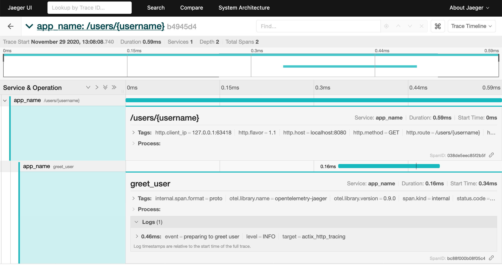

# Actix Web with Tracing example

This example shows how to export data to [Jaeger] and [Prometheus] from an
[actix-web] app instrumented using the [tracing] API and ecosystem.

[Jaeger]: https://www.jaegertracing.io
[Prometheus]: https://prometheus.io
[actix-web]: https://github.com/actix/actix-web
[tracing]: https://github.com/tokio-rs/tracing

## Setup

```shell
# Run jaeger in background
$ docker run -d -p6831:6831/udp -p6832:6832/udp -p16686:16686 -p14268:14268 jaegertracing/all-in-one:latest

# Start the actix web server
$ cargo run

# (from another terminal window)
$ curl localhost:8080/users/@ferris
=> Hello @ferris

# View spans (see the image below)
$ firefox http://localhost:16686/
```

## Generated Telemetry

### Jaeger

After completing the steps above, the following trace information is now
available:



### Prometheus (Optional)

Optional request metrics information is now exposed via `/metrics`:

```shell
$ curl localhost:8080/metrics

# HELP http_requests_duration HTTP request duration per route
# TYPE http_requests_duration histogram
http_requests_duration_bucket{method="GET",route="/users/{username}",status="200",le="0.5"} 1
http_requests_duration_bucket{method="GET",route="/users/{username}",status="200",le="0.9"} 1
http_requests_duration_bucket{method="GET",route="/users/{username}",status="200",le="0.99"} 1
http_requests_duration_bucket{method="GET",route="/users/{username}",status="200",le="+Inf"} 1
http_requests_duration_sum{method="GET",route="/users/{username}",status="200"} 0.001289
http_requests_duration_count{method="GET",route="/users/{username}",status="200"} 1
# HELP http_requests_total HTTP requests per route
# TYPE http_requests_total counter
http_requests_total{method="GET",route="/users/{username}",status="200"} 1
```

### Logs

[tracing] has been configured to report `INFO` and above level logs to stdout
via [`tracing_subscriber::fmt`] and [`tracing_subscriber::EnvFilter`] to produce
the output below:

```shell
Nov 29 13:08:04.932  INFO actix_server::builder: Starting 16 workers
Nov 29 13:08:04.933  INFO actix_server::builder: Starting "actix-web-service-127.0.0.1:8080" service on 127.0.0.1:8080
Nov 29 13:08:08.740  INFO greet_user{username="@ferris"}: actix_http_tracing: preparing to greet user
Nov 29 13:08:08.740  INFO actix_web::middleware::logger: 127.0.0.1:63418 "GET /users/@ferris HTTP/1.1" 200 13 "-" "curl/7.64.1" 0.000758
```

[tracing]: https://github.com/tokio-rs/tracing
[`tracing_subscriber::fmt`]: https://docs.rs/tracing-subscriber/latest/tracing_subscriber/fmt/index.html
[`tracing_subscriber::EnvFilter`]: https://docs.rs/tracing-subscriber/latest/tracing_subscriber/filter/struct.EnvFilter.html
