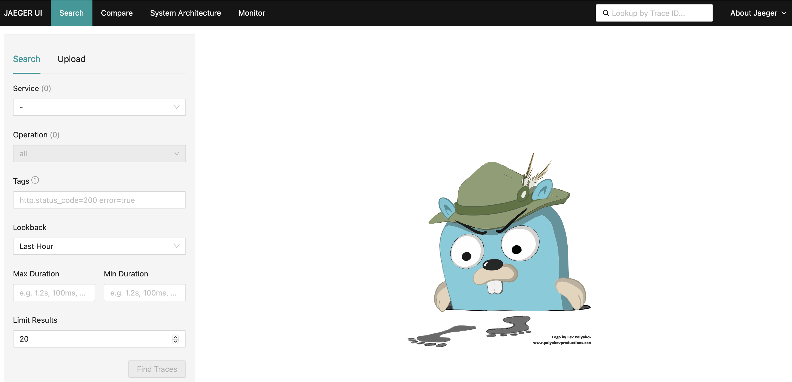
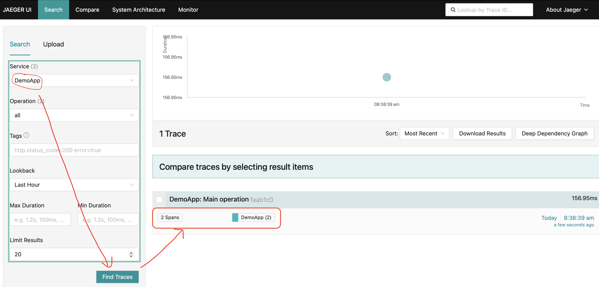
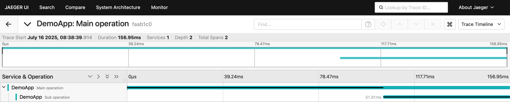
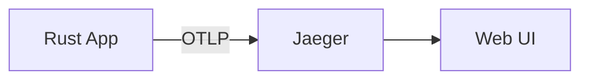

# Getting Started with OpenTelemetry Tracing in Rust

This tutorial demonstrates how to instrument a Rust application with
OpenTelemetry tracing and visualize the traces using
[Jaeger](https://www.jaegertracing.io/).

## Running the example

### Prerequisites

- **Docker**: Install from [docker.com](https://docs.docker.com/get-docker/) for
  running Jaeger locally

### Step 1: Start Jaeger

Start Jaeger using Docker:

```shell
docker run --rm -d --name jaeger \
  -p 16686:16686 \
  -p 4317:4317 \
  cr.jaegertracing.io/jaegertracing/jaeger:2.8.0
```

This exposes:

- Port `16686`: Jaeger web UI
- Port `4317`: OTLP endpoint for receiving traces

Verify it's running at <http://localhost:16686/>



### Step 2: Run the application

```shell
cargo run
```

This will:

1. Initialize OpenTelemetry with OTLP exporter pointing to `localhost:4317`
2. Create a parent span (`Main operation`) and child span (`Sub operation`)
3. Send the trace data to Jaeger

### Step 3: View traces in Jaeger

1. Open [http://localhost:16686](http://localhost:16686) and refresh
2. Select `DemoApp` from the **Service** dropdown
3. Click **Find Traces**



Click on a trace to open Trace Details view, which show the span hierarchy and timing:



You'll see the `Main operation` span containing the `Sub operation` span, along
with their timing information and any attributes or events.

## Data flow



### Cleanup

```shell
docker stop jaeger
```

## Next steps (TODO)

- Add metrics and logs instrumentation
- Add sampling and context propagation
- Add distributed tracing across multiple services
