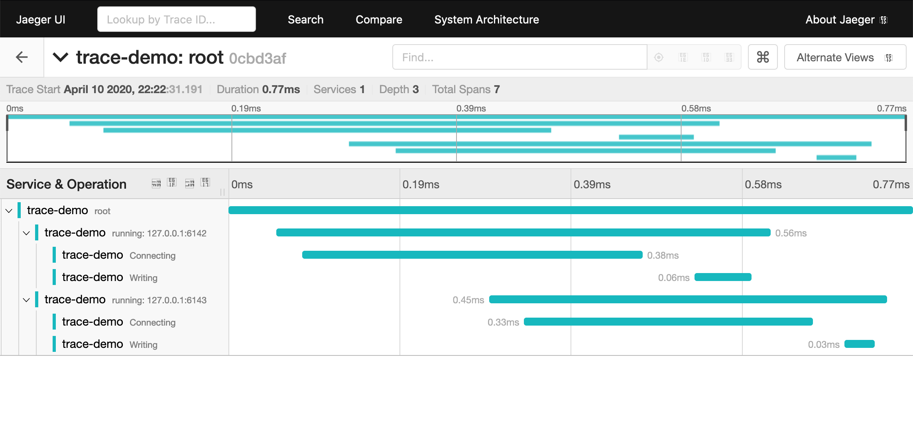

# Async OpenTelemetry Example

This example shows how to instrument asynchronous rust code using async/await.

## Usage

```shell
# Run jaeger in background
$ docker run -d -p6831:6831/udp -p6832:6832/udp -p16686:16686 jaegertracing/all-in-one:latest

# Run server 1 on port 6142
$ ncat -l 6142 # or python -m SimpleHTTPServer 6142

# Run server 2 on port 6143
$ ncat -l 6143 # or python -m SimpleHTTPServer 6143

# Run example app and report spans
$ cargo run

# View spans (see the image below)
$ firefox http://localhost:16686/
```


