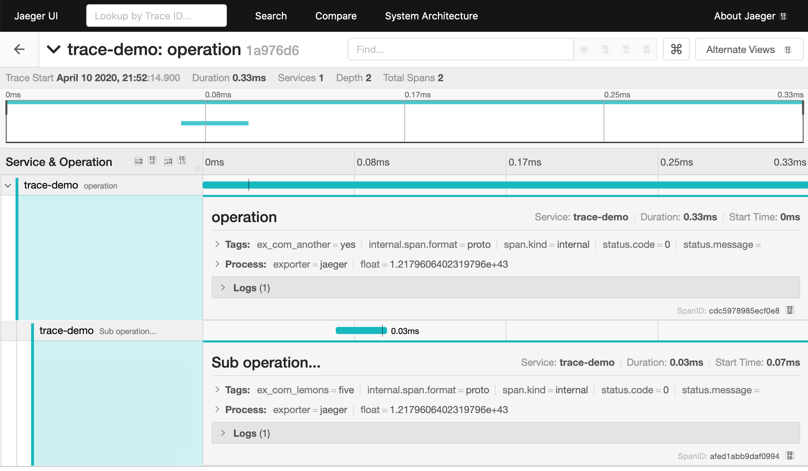

# Basic OpenTelemetry Example

This example shows basic span and metric usage, and exports to Jaeger.

## Usage

```shell
# Run jaeger in background
$ docker run -d -p6831:6831/udp -p6832:6832/udp -p16686:16686 -p14268:14268 jaegertracing/all-in-one:latest

# Report spans
$ cargo run

# View spans (see the image below)
$ firefox http://localhost:16686/
```


