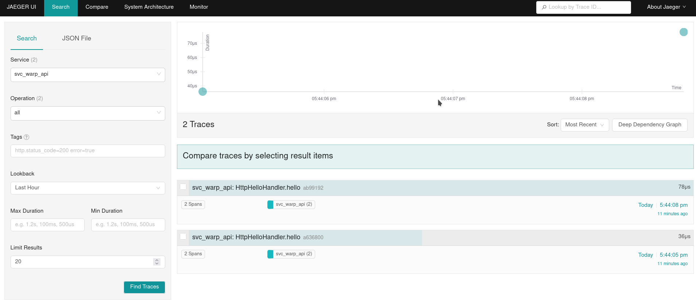
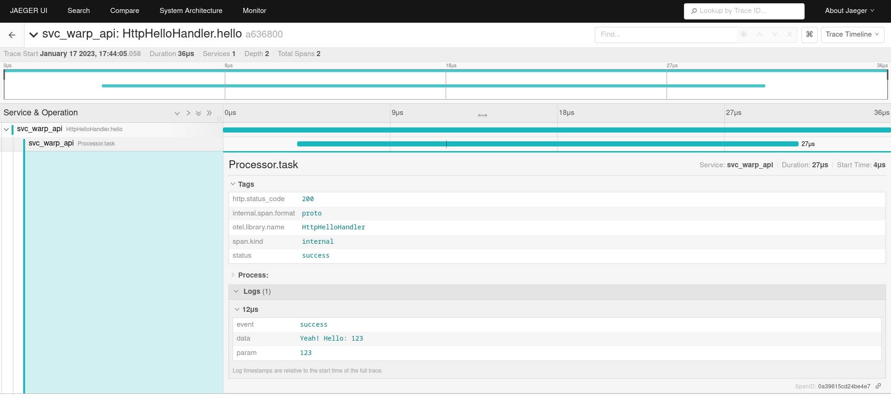
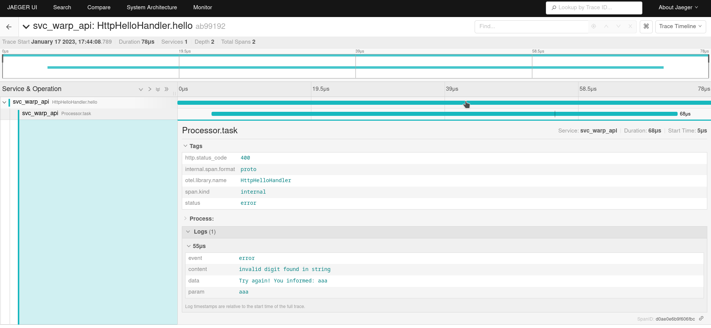
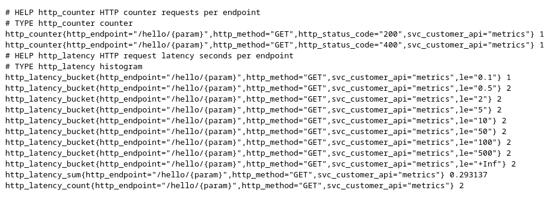

## Work with tracing span add attributes and events using parent context + scraping metrics for prometheus.

In this example, we will work with trance events that will be sent to Jaeger.
Will also show data scraping by prometheus through an exclusive port for metrics service.
However, it will be presented how to separate distinct routes for Clients and Metrics.

To run this example.

1. Start the containers Jaeger and Otel Collector. Run `docker-compose up -d`

2. Just use `cargo run` to run the example.

3. Make local requests on the Clients endpoint as in the example:
    `curl http://127.0.0.1:3000/hello/123` (succeed) or
    `curl http://127.0.0.1:3000/hello/aaa` (error)

4. Look for the results returned by Jaeger. Tip: Use the Tags field to filter your points of interest.
    `curl http://127.0.0.1:16686` (select the name of the service `svc_warp_api` and click `Find Traces`)

5. Make local requests on the Service endpoint as in the example:
    `curl http://127.0.0.1:9080/metrics`

6. Use `docker-compose down -v` to tear down the containers Jaeger and Otel Collector backend.

## Find Traces

## Trace - OK

## Trace - ERROR

## Prometheus - Metrics

