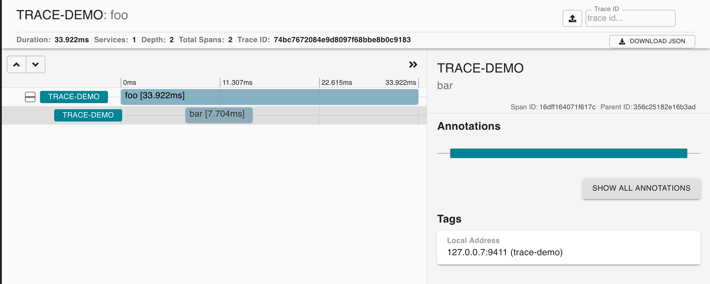

# Zipkin Exporter Example

Sends spans to a zipkin-compatible collector.

## Usage 

First run the zipkin collector:

```shell
docker run -d -p 9411:9411 openzipkin/zipkin
```

Then run the example to report spans:

```shell
$ cargo run

# View spans (see the image below)
$ firefox http://localhost:9411/
```


