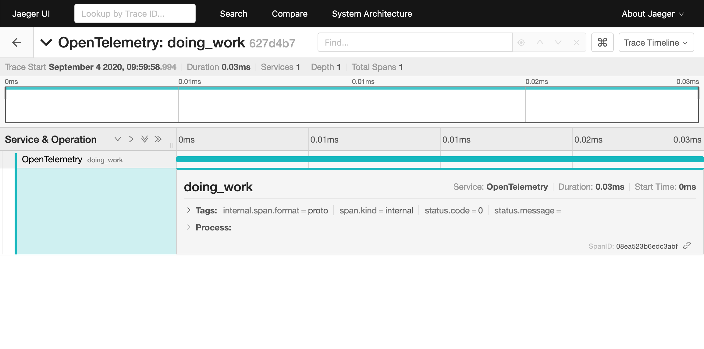

# OpenTelemetry Jaeger

Collects OpenTelemetry spans and reports them to a given Jaeger `agent` or
`collector` endpoint. See the [Jaeger Docs] for details about Jaeger and
deployment information.

[Jaeger Docs]: https://www.jaegertracing.io/docs/

### Quickstart

First make sure you have a running version of the Jaeger instance you want to
send data to:

```shell
$ docker run -d -p6831:6831/udp -p6832:6832/udp -p16686:16686 -p14268:14268 jaegertracing/all-in-one:latest
```

Then install a new jaeger pipeline with the recommended defaults to start
exporting telemetry:

```rust
use opentelemetry::api::Tracer;

fn main() -> Result<(), Box<dyn std::error::Error>> {
    let (tracer, _uninstall) = opentelemetry_jaeger::new_pipeline().install()?;

    tracer.in_span("doing_work", |cx| {
        // Traced app logic here...
    });

    Ok(())
}
```



## Performance

For optimal performance, a batch exporter is recommended as the simple exporter
will export each span synchronously on drop. You can enable the [`tokio`] or
[`async-std`] features to have a batch exporter configured for you automatically
for either executor when you install the pipeline.

```toml
[dependencies]
opentelemetry = { version = "*", features = ["tokio"] }
opentelemetry-jaeger = "*"
```

[`tokio`]: https://tokio.rs
[`async-std`]: https://async.rs

### Jaeger Exporter From Environment Variables

The jaeger pipeline builder can be configured dynamically via the [`from_env`]
method. All variables are optional, a full list of accepted options can be found
in the [jaeger variables spec].

[`from_env`]: https://docs.rs/opentelemetry-jaeger/latest/opentelemetry_jaeger/struct.PipelineBuilder.html#method.from_env
[jaeger variables spec]: https://github.com/open-telemetry/opentelemetry-specification/blob/master/specification/sdk-environment-variables.md#jaeger-exporter

```rust
use opentelemetry::api::Tracer;

fn main() -> Result<(), Box<dyn std::error::Error>> {
    // export OTEL_SERVICE_NAME=my-service-name
    let (tracer, _uninstall) = opentelemetry_jaeger::new_pipeline().from_env().install()?;

    tracer.in_span("doing_work", |cx| {
        // Traced app logic here...
    });

    Ok(())
}
```

### Jaeger Collector Example

If you want to skip the agent and submit spans directly to a Jaeger collector,
you can enable the optional `collector_client` feature for this crate. This
example expects a Jaeger collector running on `http://localhost:14268`.

```toml
[dependencies]
opentelemetry-jaeger = { version = "..", features = ["collector_client"] }
```

Then you can use the [`with_collector_endpoint`] method to specify the endpoint:

[`with_collector_endpoint`]: https://docs.rs/opentelemetry-jaeger/latest/opentelemetry_jaeger/struct.PipelineBuilder.html#method.with_collector_endpoint

```rust
// Note that this requires the `collector_client` feature.
use opentelemetry::api::Tracer;

fn main() -> Result<(), Box<dyn std::error::Error>> {
    let (tracer, _uninstall) = opentelemetry_jaeger::new_pipeline()
        .with_collector_endpoint("http://localhost:14268/api/traces")
        // optionally set username and password as well.
        .with_collector_username("username")
        .with_collector_password("s3cr3t")
        .install()?;

    tracer.in_span("doing_work", |cx| {
        // Traced app logic here...
    });

    Ok(())
}
```

## Kitchen Sink Full Configuration

Example showing how to override all configuration options. See the
[`PipelineBuilder`] docs for details of each option.

[`PipelineBuilder`]: https://docs.rs/opentelemetry-jaeger/latest/opentelemetry_jaeger/struct.PipelineBuilder.html

```rust
use opentelemetry::api::{KeyValue, Tracer};
use opentelemetry::sdk::{trace, IdGenerator, Resource, Sampler};

fn main() -> Result<(), Box<dyn std::error::Error>> {
    let (tracer, _uninstall) = opentelemetry_jaeger::new_pipeline()
        .from_env()
        .with_agent_endpoint("localhost:6831")
        .with_service_name("my_app")
        .with_tags(vec![KeyValue::new("process_key", "process_value")])
        .with_max_packet_size(65_000)
        .with_trace_config(
            trace::config()
                .with_default_sampler(Sampler::AlwaysOn)
                .with_id_generator(IdGenerator::default())
                .with_max_events_per_span(64)
                .with_max_attributes_per_span(16)
                .with_max_events_per_span(16)
                .with_resource(Resource::new(vec![KeyValue::new("key", "value")])),
        )
        .install()?;

    tracer.in_span("doing_work", |cx| {
        // Traced app logic here...
    });

    Ok(())
}
```
