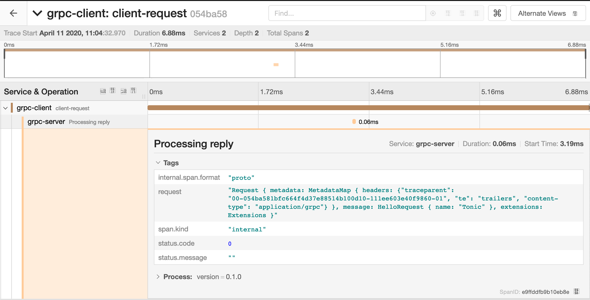

# GRPC example

Example showing [Tonic] client and server interaction with OpenTelemetry context propagation.

[Tonic]: https://github.com/hyperium/tonic

Examples
--------

```shell
# Run jaeger in background
$ docker run -d -p6831:6831/udp -p6832:6832/udp -p16686:16686 jaegertracing/all-in-one:latest

# Run the server
$ cargo run --bin grpc-server 

# Now run the client to make a request to the server
$ cargo run --bin grpc-client

# View spans (see the image below)
$ firefox http://localhost:16686/
```

